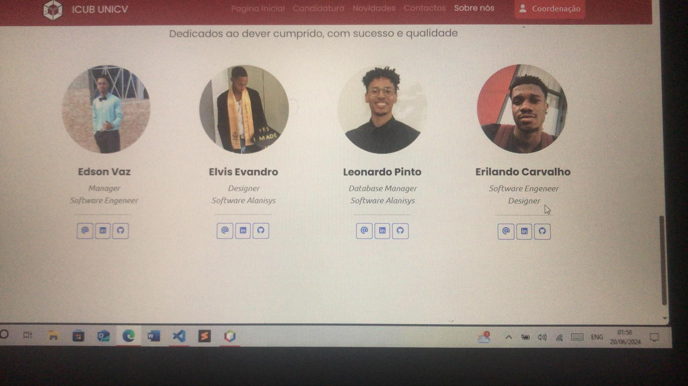
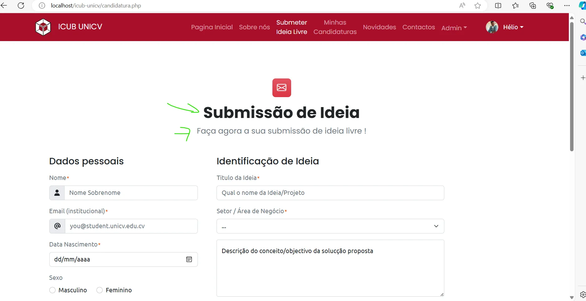
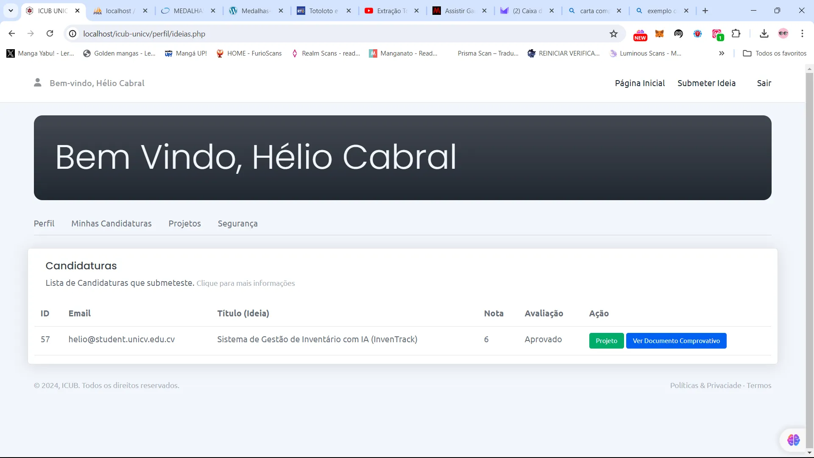
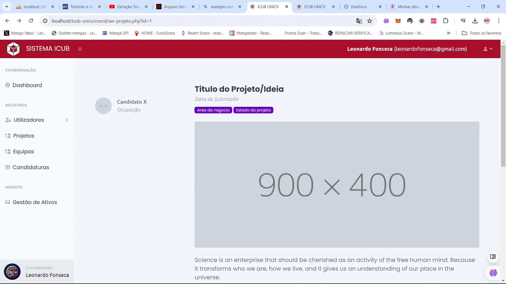
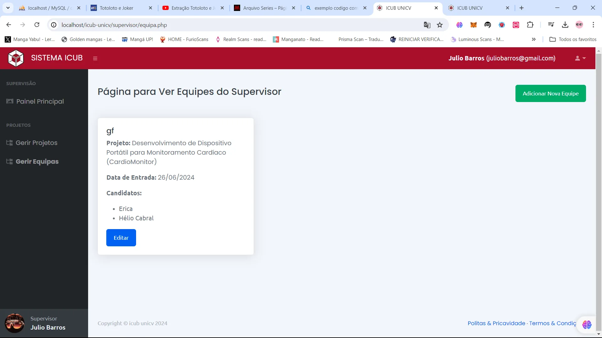

# iCUB UniCV - Sistema de Gestão de Ideias e Projetos

## Descrição do Projeto

O **iCUB UniCV** é uma plataforma web desenvolvida para a Universidade de Cabo Verde (UniCV) com o objetivo de gerir e facilitar a submissão, avaliação e acompanhamento de ideias e projetos inovadores. O sistema atua como um laboratório virtual (Cubo de Inovação), incentivando estudantes e pesquisadores a transformarem suas ideias em protótipos e soluções tecnológicas.

A plataforma oferece um ambiente amigável onde os utilizadores podem submeter suas propostas, enquanto coordenadores e supervisores podem avaliar, aprovar e gerir as equipes envolvidas no desenvolvimento dos projetos.

### Necessidade do Projeto

A inovação no ambiente acadêmico muitas vezes esbarra na falta de um canal centralizado e estruturado para a apresentação e acompanhamento de ideias. O iCUB resolve esse problema ao fornecer:
*   **Centralização:** Um único portal para todas as submissões de projetos.
*   **Organização:** Fluxos claros de aprovação e gestão de equipes.
*   **Incentivo à Inovação:** Um espaço dedicado a fomentar a criatividade em áreas como computação gráfica, inteligência artificial e realidade virtual.

## Funcionalidades Principais

*   **Submissão de Ideias:** Formulário intuitivo para que os utilizadores apresentem seus conceitos e objetivos.
*   **Gestão de Candidaturas:** Acompanhamento do status das ideias submetidas (em avaliação, aprovado, etc.).
*   **Gestão de Projetos e Equipes:** Ferramentas para supervisores e coordenadores visualizarem detalhes dos projetos e gerirem os membros das equipes.
*   **Notícias e Eventos:** Seção dedicada a manter a comunidade atualizada sobre as últimas novidades do iCUB.

## Apresentação Visual

Abaixo estão algumas imagens que demonstram a interface e as funcionalidades do sistema:

### Equipe de Desenvolvimento


### Submissão de Ideia


### Minhas Candidaturas


### Detalhes do Projeto (Visão do Coordenador)


### Gestão de Equipes (Visão do Supervisor)


### Vídeo de Demonstração
Você pode conferir um vídeo de demonstração do sistema no seguinte caminho:
[Vídeo de Demonstração](assets/video/demonstracao.mp4)

## Como Usar (Guia de Instalação com WampServer)

Para executar este projeto localmente utilizando o WampServer, siga os passos abaixo:

### Pré-requisitos
*   [WampServer](https://www.wampserver.com/en/) instalado na sua máquina.
*   Navegador web moderno.

### Passos para Instalação

1.  **Clonar o Repositório:**
    Clone este repositório diretamente para a pasta `www` do seu WampServer (geralmente localizada em `C:\wamp64\www\`).
    ```bash
    git clone https://github.com/cody007cyberdev-blip/icub-unicv.git
    ```
    *Nota: As páginas devem ficar na raiz do projeto (e não dentro de uma subpasta 'pages') para garantir o correto funcionamento das URLs.*

2.  **Configurar o Banco de Dados:**
    *   Inicie o WampServer e certifique-se de que o ícone na bandeja do sistema está verde.
    *   Acesse o phpMyAdmin através do endereço `http://localhost/phpmyadmin/`.
    *   Crie um novo banco de dados (verifique o nome esperado no arquivo de configuração do banco, geralmente `db_icub`).
    *   Importe o arquivo SQL fornecido (`db_icub.sql`) para o banco de dados recém-criado.

3.  **Estrutura de Pastas:**
    *   O arquivo `backend.php` e a pasta `backend` estão na raiz e contêm a lógica principal do sistema.
    *   Arquivos estáticos (CSS, JS, Imagens) devem ser colocados na pasta `assets`.
    *   Uploads de utilizadores (fotos de perfil, documentos) serão salvos na pasta `uploads`.
    *   Templates reutilizáveis estão na pasta `templates`.

4.  **Acessar o Sistema:**
    Abra o seu navegador e acesse o endereço:
    ```text
    http://localhost/icub-unicv/
    ```

## Contribuição

A melhor forma de contribuir para este projeto é mantendo a organização:
*   Coloque todos os arquivos de estilo, javascript e imagens na pasta `assets`.
*   Fotos de perfil ou documentos carregados pelos utilizadores devem ir para a pasta `uploads`.
*   Quaisquer templates reutilizáveis devem ser colocados na pasta `templates`.

---
*Desenvolvido para a Universidade de Cabo Verde (UniCV).*
